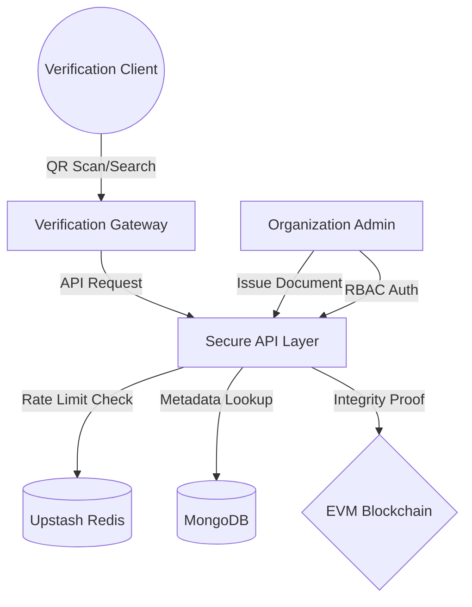

# <p align="center">EtherVault</p>

<p align="center">
  
  
</p>

## Enterprise-Grade Document Sovereignty
**EtherVault** is an immutable document verification ecosystem engineered for high-integrity organizations. By leveraging decentralized blockchain anchors and a multi-tenant architecture, EtherVault provides a cryptographic "Source of Truth" for digital credentials, legal certifications, and sensitive documentation.

The platform bridges the gap between complex blockchain infrastructure and premium user experience.

---

## Core Capabilities

*   **Cryptographic Anchoring**: Every document issuance is hashed and permanently anchored to the Blockchain, ensuring zero-knowledge proof of integrity.
*   **Multi-Tenant Infrastructure**: Enterprise-ready architecture supporting isolated organizational silos within a unified verification gateway.
*   **Military-Grade Security**: Role-Based Access Control (RBAC) enforced at the protocol level, protecting issuance workflows from unauthorized access.
*   **Zero-Leak Verification**: A privacy-first verification engine that validates authenticity without exposing underlying metadata or storage locations.
*   **Instant Proof Generation**: Dynamic QR-Code generation and deep-link integration for immediate, mobile-first verification.
*   **Adaptive Rate Limiting**: Flood protection ensures high availability for public verification lookups.

---

## Technology Stack

### Protocol Layer
- **Smart Contracts**: Solidity / Hardhat
- **Blockchain Interface**: Ethers.js v6 
- **Hashing**: SHA-256 Cryptographic Standards

### Backend Infrastructure
- **Runtime**: Node.js / Express.js (High-performance API)
- **Data Persistence**: MongoDB (Mongoose ODM)
- **Auth Protocol**: JWT with BcryptJS Salting

### Experience Layer
- **Framework**: Next.js 15+ (App Router, Server Components)
- **Visual Design**: Tailwind CSS 4, Radix UI (Headless primitives)
- **Motion Orchestration**: GSAP, Lenis Smooth Scroll
- **State Engine**: Zustand

---

## System Architecture



---

## Repository Architecture

| Directory | Scope |
| :--- | :--- |
| [`/client`](./client) | Next.js Frontend |
| [`/server`](./server) | Node.js Backend - RBAC & API Infrastructure |
| [`/chain`](./chain) | Hardhat Environment - Smart Contracts & Deployment |

---

## Deployment Guide

### System Requirements
- Node.js (v20+ Recommended)
- MongoDB Instance (Local or Atlas)
- Redis Connection (Upstash Recommended)

### 1. Protocol Deployment
```bash
cd chain
npm install
npx hardhat node # Start local network
npx hardhat run scripts/deploy.js --network localhost
```

### 2. Infrastructure Setup
```bash
cd server
npm install
# Configure .env (see Variables section)
npm run dev
```

### 3. Frontend Orchestration
```bash
cd client
npm install
# Configure .env
npm run dev
```

---

## Environment Specifications

### Server configuration (`/server/.env`)
```env
FRONTEND_URL=your-next.js-app-url
MONGO_URI=your-mongodb-uri
UPSTASH_REDIS_REST_URL=your-upstash-url
UPSTASH_REDIS_REST_TOKEN=your-upstash-token
JWT_SECRET=your-jwt-secret # 256 bits recommended
PINATA_API_KEY=your-pinata-api-key
PINATA_SECRET_API_KEY=your-pinata-secret-api-key
PINATA_JWT=your-pinata-jwt
PINATA_GATEWAY_URL=your-pinata-gateway-url
PRIVATE_KEY=your-private-key
CONTRACT_ADDRESS=your-contract-address 
```

### Client configuration (`/client/.env.local`)
```env
NEXT_PUBLIC_SERVER_URL=your-server-url
```

---

## Security Posture
EtherVault undergoes continuous internal auditing focusing on:
- **Collision Resistance**: Document hashes are calculated client-side before submission.
- **Data Obfuscation**: Public endpoints return filtered DTOs (Data Transfer Objects).
- **Abuse Prevention**: Intelligent rate-limiting tiers based on endpoint sensitivity.

---

<p align="center">
  Built for the Future of Decentralized Trust.
</p>
