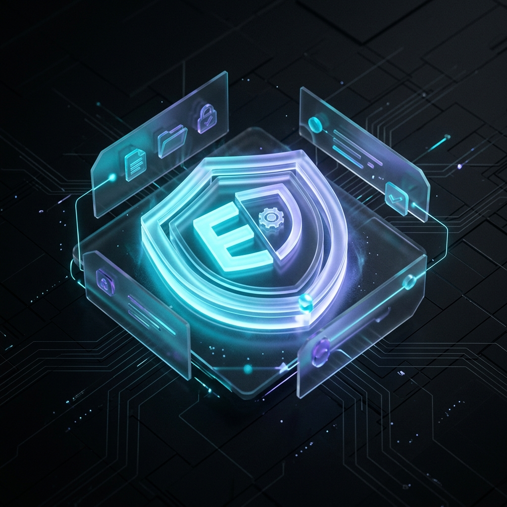
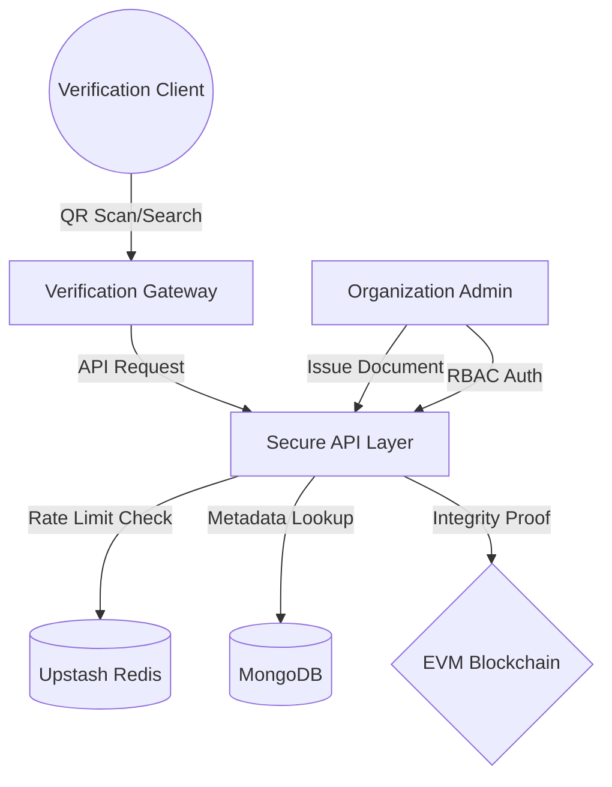

# <p align="center">EtherVault</p>

<p align="center">
  
  
  
  
</p>



## Enterprise-Grade Document Sovereignty
**EtherVault** is an immutable document verification ecosystem engineered for high-integrity organizations. By leveraging decentralized blockchain anchors and a multi-tenant architecture, EtherVault provides a cryptographic "Source of Truth" for digital credentials, legal certifications, and sensitive documentation.

Designed with a **Stealth-Luxury** aesthetic, the platform bridges the gap between complex blockchain infrastructure and premium user experience.

---

## Core Capabilities

*   **Cryptographic Anchoring**: Every document issuance is hashed and permanently anchored to the Ethereum EVM, ensuring zero-knowledge proof of integrity.
*   **Multi-Tenant Infrastructure**: Enterprise-ready architecture supporting isolated organizational silos within a unified verification gateway.
*   **Military-Grade Security**: Role-Based Access Control (RBAC) enforced at the protocol level, protecting issuance workflows from unauthorized access.
*   **Zero-Leak Verification**: A privacy-first verification engine that validates authenticity without exposing underlying metadata or storage locations.
*   **Instant Proof Generation**: Dynamic QR-Code generation and deep-link integration for immediate, mobile-first verification.
*   **Adaptive Rate Limiting**: Upstash-backed flood protection ensures high availability for public verification lookups.

---

## Technology Stack

### Protocol Layer
- **Smart Contracts**: Solidity / Hardhat
- **Blockchain Interface**: Ethers.js v6 (Type-safe integration)
- **Hashing**: SHA-256 Cryptographic Standards

### Backend Infrastructure
- **Runtime**: Node.js / Express.js (High-performance API)
- **Data Persistence**: MongoDB (Mongoose ODM)
- **Traffic Orchestration**: Upstash Redis (Serverless Caching)
- **Auth Protocol**: JWT with BcryptJS Salting

### Experience Layer
- **Framework**: Next.js 15+ (App Router, Server Components)
- **Visual Design**: Tailwind CSS 4, Radix UI (Headless primitives)
- **Motion Orchestration**: GSAP, Framer Motion, Lenis Smooth Scroll
- **State Engine**: Zustand (Zero-boilerplate management)

---

## System Architecture



---

## Repository Architecture

| Directory | Scope |
| :--- | :--- |
| [`/client`](./client) | Next.js Frontend - Luxury UI & Verification Logic |
| [`/server`](./server) | Node.js Backend - RBAC & API Infrastructure |
| [`/chain`](./chain) | Hardhat Environment - Smart Contracts & Deployment |

---

## Deployment Guide

### System Requirements
- Node.js (v20+ Recommended)
- MongoDB Instance (Local or Atlas)
- Redis Connection (Upstash Recommended)

### 1. Protocol Deployment
```bash
cd chain
npm install
npx hardhat node # Start local network
npx hardhat run scripts/deploy.js --network localhost
```

### 2. Infrastructure Setup
```bash
cd server
npm install
# Configure .env (see Variables section)
npm run dev
```

### 3. Frontend Orchestration
```bash
cd client
npm install
# Configure .env.local
npm run dev
```

---

## Environment Specifications

### Server configuration (`/server/.env`)
```env
PORT=5000
MONGODB_URI=your_mongodb_connection_string
JWT_SECRET=your_secure_secret_key
REDIS_URL=your_redis_connection_url
PRIVATE_KEY=your_evm_private_key
CONTRACT_ADDRESS=your_deployed_contract
```

### Client configuration (`/client/.env.local`)
```env
NEXT_PUBLIC_API_URL=http://localhost:5000
NEXT_PUBLIC_CONTRACT_ADDRESS=your_deployed_contract
```

---

## Security Posture
EtherVault undergoes continuous internal auditing focusing on:
- **Collision Resistance**: Document hashes are calculated client-side before submission.
- **Data Obfuscation**: Public endpoints return filtered DTOs (Data Transfer Objects).
- **Abuse Prevention**: Intelligent rate-limiting tiers based on endpoint sensitivity.

---

## Licensing
This ecosystem is distributed under the **ISC License**. Commercial use and redistribution are permitted under the terms of the license.

<p align="center">
  Built for the Future of Decentralized Trust.
</p>
